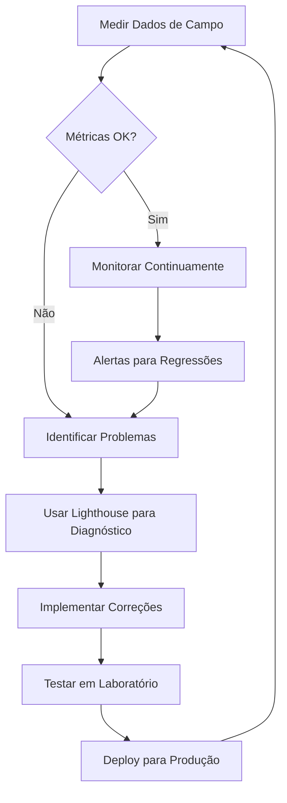

# 🚀 Google Core Web Vitals - Guia Completo de Melhores Práticas

> **Baseado na documentação oficial do Google** - Análise de 59 arquivos de melhores práticas

## 📋 Índice

1. [Visão Geral](#visão-geral)
2. [As 3 Métricas Principais](#as-3-métricas-principais)
3. [Limites e Classificações](#limites-e-classificações)
4. [Ferramentas de Medição](#ferramentas-de-medição)
5. [Otimizações por Métrica](#otimizações-por-métrica)
6. [Implementação Prática](#implementação-prática)
7. [Monitoramento Contínuo](#monitoramento-contínuo)

## 🎯 Visão Geral

As **Core Web Vitals** são um conjunto de métricas específicas que o Google considera importantes para a experiência do usuário em uma página web. Elas fazem parte dos sinais de experiência da página usados no ranking de pesquisa.

### ✅ **Por que são importantes?**
- **SEO**: Impactam diretamente o ranking no Google
- **UX**: Medem aspectos reais da experiência do usuário
- **Conversão**: Páginas mais rápidas convertem melhor
- **Retenção**: Usuários permanecem mais tempo em sites rápidos

## 🎯 As 3 Métricas Principais

### 1. **LCP - Largest Contentful Paint**
**O que mede**: Tempo para carregar o maior elemento visível na tela

**Elementos comuns do LCP**:
- Imagens ``
- Elementos `<image>` dentro de `<svg>`
- Elementos `<video>` com poster
- Elementos com background-image via CSS
- Blocos de texto (parágrafos, cabeçalhos)

**Limites**:
- ✅ **Bom**: ≤ 2.5 segundos
- ⚠️ **Precisa melhorar**: 2.5s - 4.0s
- ❌ **Ruim**: > 4.0 segundos

### 2. **INP - Interaction to Next Paint**
**O que mede**: Responsividade da página às interações do usuário

**Tipos de interação medidos**:
- Cliques com mouse
- Toques em tela sensível
- Pressionamento de teclas

**Limites**:
- ✅ **Bom**: ≤ 200 milissegundos
- ⚠️ **Precisa melhorar**: 200ms - 500ms
- ❌ **Ruim**: > 500 milissegundos

### 3. **CLS - Cumulative Layout Shift**
**O que mede**: Estabilidade visual da página durante o carregamento

**Causas comuns de CLS**:
- Imagens sem dimensões definidas
- Anúncios, embeds e iframes sem espaço reservado
- Fontes web que causam FOIT/FOUT
- Conteúdo injetado dinamicamente

**Limites**:
- ✅ **Bom**: ≤ 0.1
- ⚠️ **Precisa melhorar**: 0.1 - 0.25
- ❌ **Ruim**: > 0.25

## 📊 Limites e Classificações

### **Critério de Avaliação**
O Google usa o **75º percentil** de todas as experiências de usuário para classificar uma página:

```
Se 75% dos usuários têm uma experiência "Boa" = Página aprovada
Se menos de 75% têm experiência "Boa" = Página reprovada
```

### **Agregação das Métricas**
Para passar na avaliação das Core Web Vitals:
- **Todas as 3 métricas** devem estar na categoria "Bom" no 75º percentil
- Se INP não tiver dados suficientes, apenas LCP e CLS são consideradas
- Se LCP ou CLS não tiverem dados, a página não pode ser avaliada

## 🛠️ Ferramentas de Medição

### **Dados de Campo (RUM - Real User Monitoring)**
- **Chrome User Experience Report (CrUX)**
- **PageSpeed Insights** - Dados reais dos últimos 28 dias
- **Search Console** - Relatório Core Web Vitals
- **Biblioteca web-vitals** - Coleta própria de dados

### **Dados de Laboratório**
- **Lighthouse** - Auditoria em ambiente controlado
- **Chrome DevTools** - Painel Performance
- **WebPageTest** - Testes sintéticos
- **PageSpeed Insights** - Seção de laboratório

### **Diferenças entre Campo vs Laboratório**

| Aspecto | Dados de Campo | Dados de Laboratório |
|---------|----------------|---------------------|
| **Fonte** | Usuários reais | Ambiente simulado |
| **Variabilidade** | Alta (diferentes dispositivos/redes) | Baixa (condições controladas) |
| **Representatividade** | Real | Aproximada |
| **Uso** | Monitoramento | Diagnóstico |

## ⚡ Otimizações por Métrica

### **🎯 Otimizando LCP**

#### **1. Otimizar o Servidor**
```html
<!-- Preconnect para recursos críticos -->
<link rel="preconnect" href="https://fonts.googleapis.com">
<link rel="preconnect" href="https://cdn.example.com">

<!-- Preload para recursos LCP -->
<link rel="preload" as="image" href="/hero-image.jpg">
```

#### **2. Otimizar Imagens**
```html
<!-- Usar formatos modernos -->
<picture>
  <source srcset="hero.avif" type="image/avif">
  <source srcset="hero.webp" type="image/webp">
  
</picture>

<!-- Responsive images -->

```

#### **3. Otimizar CSS**
```css
/* CSS crítico inline */
<style>
  .hero { 
    background-image: url('/hero.jpg');
    width: 100%;
    height: 400px;
  }
</style>

/* CSS não-crítico carregado após */
<link rel="preload" href="/styles.css" as="style" onload="this.onload=null;this.rel='stylesheet'">
```

### **🎯 Otimizando INP**

#### **1. Reduzir JavaScript Bloqueante**
```javascript
// ❌ Evitar
document.addEventListener('click', function(e) {
  // Processamento pesado síncrono
  heavyCalculation();
});

// ✅ Melhor
document.addEventListener('click', function(e) {
  // Usar requestIdleCallback ou setTimeout
  requestIdleCallback(() => {
    heavyCalculation();
  });
});
```

#### **2. Code Splitting**
```javascript
// ✅ Carregar código sob demanda
const button = document.querySelector('#heavy-feature');
button.addEventListener('click', async () => {
  const { heavyFeature } = await import('./heavy-feature.js');
  heavyFeature();
});
```

#### **3. Web Workers**
```javascript
// ✅ Mover processamento pesado para Web Worker
const worker = new Worker('/worker.js');
worker.postMessage(data);
worker.onmessage = (e) => {
  updateUI(e.data);
};
```

### **🎯 Otimizando CLS**

#### **1. Definir Dimensões de Imagens**
```html
<!-- ✅ Sempre incluir width e height -->


<!-- ✅ Usar aspect-ratio CSS -->
<style>
  .image-container {
    aspect-ratio: 16 / 9;
  }
  .image-container img {
    width: 100%;
    height: 100%;
    object-fit: cover;
  }
</style>
```

#### **2. Reservar Espaço para Anúncios**
```css
/* ✅ Reservar espaço para anúncios */
.ad-container {
  min-height: 250px;
  background: #f0f0f0;
  display: flex;
  align-items: center;
  justify-content: center;
}

.ad-container::before {
  content: "Carregando anúncio...";
  color: #666;
}
```

#### **3. Otimizar Fontes Web**
```html
<!-- ✅ Preload fontes críticas -->
<link rel="preload" href="/fonts/main.woff2" as="font" type="font/woff2" crossorigin>

<!-- ✅ Usar font-display: swap -->
<style>
  @font-face {
    font-family: 'CustomFont';
    src: url('/fonts/main.woff2') format('woff2');
    font-display: swap; /* Evita FOIT */
  }
</style>
```

## 💻 Implementação Prática

### **1. Medição com JavaScript**
```javascript
// Instalar: npm install web-vitals
import { onCLS, onINP, onLCP } from 'web-vitals';

// Medir e enviar para analytics
onCLS(console.log);
onINP(console.log);
onLCP(console.log);

// Enviar para Google Analytics
function sendToGoogleAnalytics({name, delta, value, id}) {
  gtag('event', name, {
    event_category: 'Web Vitals',
    event_label: id,
    value: Math.round(name === 'CLS' ? delta * 1000 : delta),
    non_interaction: true,
  });
}

onCLS(sendToGoogleAnalytics);
onINP(sendToGoogleAnalytics);
onLCP(sendToGoogleAnalytics);
```

### **2. Configuração de Monitoramento**
```javascript
// Configuração avançada
import { onCLS, onINP, onLCP } from 'web-vitals';

const vitalsUrl = 'https://analytics.example.com/vitals';

function sendToAnalytics(metric) {
  const body = JSON.stringify(metric);
  
  // Usar sendBeacon se disponível
  if (navigator.sendBeacon) {
    navigator.sendBeacon(vitalsUrl, body);
  } else {
    fetch(vitalsUrl, {
      body,
      method: 'POST',
      keepalive: true,
    });
  }
}

// Configurar todas as métricas
onCLS(sendToAnalytics);
onINP(sendToAnalytics);
onLCP(sendToAnalytics);
```

## 📈 Monitoramento Contínuo

### **1. Fluxo de Trabalho Recomendado**



### **2. Alertas e Thresholds**
```javascript
// Configurar alertas para regressões
const thresholds = {
  LCP: 2500,  // ms
  INP: 200,   // ms
  CLS: 0.1    // score
};

function checkThresholds(metric) {
  if (metric.value > thresholds[metric.name]) {
    // Enviar alerta
    sendAlert(`${metric.name} threshold exceeded: ${metric.value}`);
  }
}
```

### **3. Relatórios Regulares**
- **Diário**: Monitoramento automático via CrUX API
- **Semanal**: Análise de tendências e regressões
- **Mensal**: Relatório executivo com insights
- **Trimestral**: Revisão de estratégia e metas

## 🎯 Checklist de Implementação

### **✅ Básico**
- [ ] Implementar medição com web-vitals
- [ ] Configurar PageSpeed Insights
- [ ] Adicionar Search Console
- [ ] Definir dimensões de imagens

### **✅ Intermediário**
- [ ] Otimizar LCP (preload, preconnect)
- [ ] Implementar lazy loading
- [ ] Configurar font-display: swap
- [ ] Code splitting básico

### **✅ Avançado**
- [ ] Web Workers para tarefas pesadas
- [ ] Service Worker para cache
- [ ] Monitoramento RUM personalizado
- [ ] Alertas automáticos para regressões

---

**📅 Última atualização**: 2025-01-09  
**🔧 Baseado em**: Documentação oficial do Google (59 arquivos analisados)  
**📊 Fonte**: Core Web Vitals, PageSpeed Insights, Chrome DevTools
