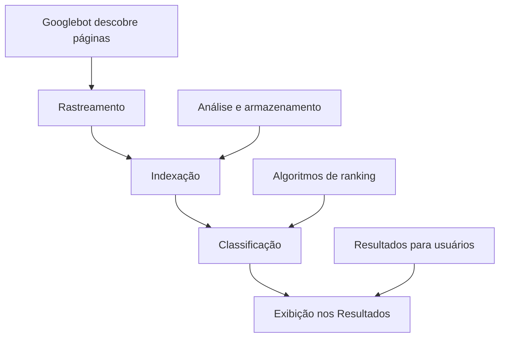

# 🔍 Google Search Console - Guia Completo de SEO e Monitoramento

> **Baseado na documentação oficial do Google** - Análise de 5 arquivos do Search Console + projetos de web scraping

## 📋 Índice

1. [Visão Geral](#visão-geral)
2. [Fundamentos da Pesquisa Google](#fundamentos-da-pesquisa-google)
3. [Configuração e Verificação](#configuração-e-verificação)
4. [Relatórios Principais](#relatórios-principais)
5. [SEO e Otimização](#seo-e-otimização)
6. [Dados Estruturados](#dados-estruturados)
7. [Monitoramento e Alertas](#monitoramento-e-alertas)
8. [Troubleshooting](#troubleshooting)

## 🎯 Visão Geral

### **O que é o Google Search Console?**
O Google Search Console é uma ferramenta **gratuita** do Google que ajuda desenvolvedores, proprietários de sites e profissionais de SEO a:
- **Monitorar** o desempenho do site na Pesquisa Google
- **Entender** como o Google vê e indexa seu conteúdo
- **Identificar** e corrigir problemas de SEO
- **Otimizar** a presença nos resultados de pesquisa

### **Por que é essencial?**
- ✅ **Visibilidade**: Monitore como seu site aparece na pesquisa
- ✅ **Performance**: Analise cliques, impressões e posições
- ✅ **Problemas**: Identifique erros de indexação e rastreamento
- ✅ **Oportunidades**: Descubra palavras-chave e melhorias
- ✅ **Gratuito**: Ferramenta oficial sem custos

### **Principais Benefícios**
```
📊 Dados reais de performance
🔍 Insights de palavras-chave
⚠️ Alertas de problemas
📈 Tendências de tráfego
🛠️ Ferramentas de diagnóstico
```

## 🏗️ Fundamentos da Pesquisa Google

### **Como Funciona a Pesquisa Google**


### **Requisitos Técnicos Mínimos**
Para uma página aparecer na Pesquisa Google:

#### **1. Googlebot não está bloqueado**
```html
<!-- ✅ Permitir rastreamento -->
<!-- robots.txt -->
User-agent: *
Allow: /

<!-- ❌ Bloquear rastreamento -->
User-agent: Googlebot
Disallow: /
```

#### **2. Página funciona (HTTP 200)**
```bash
# Verificar status da página
curl -I https://exemplo.com/pagina
# Deve retornar: HTTP/1.1 200 OK
```

#### **3. Conteúdo indexável**
```html
<!-- ✅ Conteúdo indexável -->
<h1>Título da Página</h1>
<p>Conteúdo textual relevante...</p>

<!-- ❌ Conteúdo não indexável -->
<div style="display:none">Texto oculto</div>
```

### **Políticas de Spam**
Evite estas práticas que podem prejudicar seu ranking:

#### **❌ Técnicas Proibidas**
- **Cloaking**: Mostrar conteúdo diferente para usuários e bots
- **Keyword stuffing**: Excesso de palavras-chave
- **Links spam**: Compra/venda de links para ranking
- **Conteúdo duplicado**: Cópia de outros sites
- **Texto oculto**: Conteúdo invisível para usuários

#### **✅ Melhores Práticas**
- **Conteúdo útil**: Priorize valor para o usuário
- **Palavras-chave naturais**: Use termos relevantes naturalmente
- **Links orgânicos**: Construa autoridade naturalmente
- **Originalidade**: Crie conteúdo único e valioso
- **Transparência**: Seja claro e honesto

## ⚙️ Configuração e Verificação

### **1. Verificar Propriedade do Site**

#### **Métodos de Verificação**
```html
<!-- Método 1: Meta tag HTML -->
<meta name="google-site-verification" content="SEU_CODIGO_AQUI" />

<!-- Método 2: Arquivo HTML -->
<!-- Criar arquivo: google[codigo].html na raiz do site -->

<!-- Método 3: Google Analytics -->
<!-- Se já usa GA, pode verificar automaticamente -->

<!-- Método 4: Google Tag Manager -->
<!-- Se já usa GTM, pode verificar automaticamente -->
```

#### **Verificação via DNS**
```dns
# Adicionar registro TXT no DNS
google-site-verification=SEU_CODIGO_AQUI
```

### **2. Configuração Inicial**

#### **Definir Domínio Preferido**
```
Escolher entre:
- https://exemplo.com (preferido)
- https://www.exemplo.com
- http://exemplo.com
- http://www.exemplo.com
```

#### **Configurar Segmentação Geográfica**
```
Para sites locais:
- Definir país de destino
- Configurar hreflang para múltiplos idiomas
- Usar domínios locais (.com.br, .co.uk)
```

### **3. Enviar Sitemap**
```xml
<!-- sitemap.xml -->
<?xml version="1.0" encoding="UTF-8"?>
<urlset xmlns="http://www.sitemaps.org/schemas/sitemap/0.9">
  <url>
    <loc>https://exemplo.com/</loc>
    <lastmod>2025-01-09</lastmod>
    <changefreq>daily</changefreq>
    <priority>1.0</priority>
  </url>
  <url>
    <loc>https://exemplo.com/produtos</loc>
    <lastmod>2025-01-09</lastmod>
    <changefreq>weekly</changefreq>
    <priority>0.8</priority>
  </url>
</urlset>
```

## 📊 Relatórios Principais

### **1. Relatório de Performance**

#### **Métricas Principais**
- **Cliques**: Número de cliques do Google para seu site
- **Impressões**: Quantas vezes seu site apareceu nos resultados
- **CTR**: Taxa de cliques (cliques ÷ impressões)
- **Posição média**: Posição média nos resultados de pesquisa

#### **Filtros Úteis**
```
📅 Período: Últimos 3 meses
🔍 Consultas: Palavras-chave específicas
📄 Páginas: URLs específicas
🌍 Países: Segmentação geográfica
📱 Dispositivos: Mobile, Desktop, Tablet
```

#### **Análise de Dados**
```javascript
// Exemplo de análise de performance
const performanceData = {
    cliques: 1250,
    impressoes: 15000,
    ctr: 8.3, // %
    posicaoMedia: 12.5
};

// CTR baixo + posição boa = melhorar title/description
if (performanceData.ctr < 5 && performanceData.posicaoMedia < 10) {
    console.log("Otimizar title e meta description");
}

// Impressões altas + posição ruim = melhorar conteúdo
if (performanceData.impressoes > 10000 && performanceData.posicaoMedia > 20) {
    console.log("Otimizar conteúdo e SEO on-page");
}
```

### **2. Relatório de Indexação**

#### **Status de Indexação**
- **Válidas**: Páginas indexadas com sucesso
- **Válidas com avisos**: Indexadas mas com problemas menores
- **Erro**: Páginas não indexadas por problemas
- **Excluídas**: Páginas deliberadamente não indexadas

#### **Problemas Comuns**
```
❌ Erro 404: Página não encontrada
❌ Erro 500: Erro interno do servidor
❌ Bloqueado por robots.txt
❌ Redirecionamento
❌ Conteúdo duplicado
❌ Página sem conteúdo
```

### **3. Relatório de Core Web Vitals**

#### **Métricas Monitoradas**
- **LCP**: Largest Contentful Paint (≤ 2.5s)
- **INP**: Interaction to Next Paint (≤ 200ms)
- **CLS**: Cumulative Layout Shift (≤ 0.1)

#### **Status das Páginas**
```
🟢 Bom: Atende aos limites recomendados
🟡 Precisa melhorar: Entre os limites
🔴 Ruim: Acima dos limites aceitáveis
```

### **4. Relatório de Usabilidade Mobile**

#### **Problemas Comuns**
- **Texto muito pequeno**: Fonte menor que 12px
- **Elementos clicáveis próximos**: Botões muito juntos
- **Conteúdo mais largo que tela**: Scroll horizontal
- **Viewport não configurado**: Falta meta viewport

#### **Correções**
```html
<!-- ✅ Viewport responsivo -->
<meta name="viewport" content="width=device-width, initial-scale=1">

<!-- ✅ Texto legível -->
<style>
body { font-size: 16px; line-height: 1.5; }
</style>

<!-- ✅ Elementos clicáveis -->
<style>
button, a { 
    min-height: 44px; 
    margin: 8px;
    padding: 12px;
}
</style>
```

## 🎯 SEO e Otimização

### **Guia de SEO para Iniciantes**

#### **1. Conteúdo de Qualidade**
```html
<!-- ✅ Título otimizado -->
<title>Como Fazer Bolo de Chocolate - Receita Fácil e Rápida</title>

<!-- ✅ Meta description atrativa -->
<meta name="description" content="Aprenda a fazer bolo de chocolate em 30 minutos. Receita simples com ingredientes básicos. Resultado fofo e saboroso garantido!">

<!-- ✅ Estrutura de cabeçalhos -->
<h1>Como Fazer Bolo de Chocolate</h1>
<h2>Ingredientes Necessários</h2>
<h3>Para a Massa</h3>
<h3>Para a Cobertura</h3>
<h2>Modo de Preparo</h2>
```

#### **2. Palavras-chave Estratégicas**
```
🎯 Pesquisa de palavras-chave:
- Use ferramentas como Google Keyword Planner
- Analise a concorrência
- Foque em long-tail keywords
- Considere intenção de busca

📍 Posicionamento:
- Título da página (H1)
- Meta description
- Primeiros parágrafos
- Alt text de imagens
- URLs amigáveis
```

#### **3. Otimização de Imagens**
```html
<!-- ✅ Imagem otimizada -->


<!-- ✅ Imagens responsivas -->
<picture>
  <source srcset="bolo-mobile.webp" media="(max-width: 768px)">
  <source srcset="bolo-desktop.webp" media="(min-width: 769px)">
  
</picture>
```

#### **4. Links Internos e Externos**
```html
<!-- ✅ Links internos relevantes -->
<p>Para acompanhar, veja nossa <a href="/receitas/cobertura-chocolate">receita de cobertura de chocolate</a>.</p>

<!-- ✅ Links externos com nofollow quando apropriado -->
<p>Baseado na técnica do <a href="https://exemplo.com" rel="nofollow">Chef Famoso</a>.</p>

<!-- ✅ Texto âncora descritivo -->
<a href="/receitas/bolos">Veja mais receitas de bolos caseiros</a>
```

### **Otimização para Dispositivos Móveis**

#### **Design Responsivo**
```css
/* ✅ CSS responsivo */
@media (max-width: 768px) {
    .container {
        padding: 16px;
        font-size: 16px;
    }
    
    .button {
        min-height: 44px;
        padding: 12px 24px;
    }
}
```

#### **Performance Mobile**
```html
<!-- ✅ Recursos otimizados -->
<link rel="preload" href="/fonts/main.woff2" as="font" type="font/woff2" crossorigin>
<link rel="preconnect" href="https://fonts.googleapis.com">

<!-- ✅ CSS crítico inline -->
<style>
/* CSS crítico above-the-fold */
body { font-family: system-ui; margin: 0; }
.hero { background: #f0f0f0; padding: 20px; }
</style>
```

## 📊 Dados Estruturados

### **Tipos Principais de Schema**

#### **1. Artigos e Blog Posts**
```html
<script type="application/ld+json">
{
  "@context": "https://schema.org",
  "@type": "Article",
  "headline": "Como Fazer Bolo de Chocolate",
  "description": "Receita completa de bolo de chocolate caseiro",
  "author": {
    "@type": "Person",
    "name": "Maria Silva"
  },
  "datePublished": "2025-01-09",
  "dateModified": "2025-01-09",
  "image": "https://exemplo.com/bolo-chocolate.jpg"
}
</script>
```

#### **2. Produtos e E-commerce**
```html
<script type="application/ld+json">
{
  "@context": "https://schema.org",
  "@type": "Product",
  "name": "Forma para Bolo de Chocolate",
  "description": "Forma antiaderente para bolos de 25cm",
  "brand": {
    "@type": "Brand",
    "name": "CozinhaPro"
  },
  "offers": {
    "@type": "Offer",
    "price": "29.90",
    "priceCurrency": "BRL",
    "availability": "https://schema.org/InStock"
  },
  "aggregateRating": {
    "@type": "AggregateRating",
    "ratingValue": "4.5",
    "reviewCount": "127"
  }
}
</script>
```

#### **3. Receitas**
```html
<script type="application/ld+json">
{
  "@context": "https://schema.org",
  "@type": "Recipe",
  "name": "Bolo de Chocolate Caseiro",
  "description": "Receita fácil de bolo de chocolate",
  "prepTime": "PT15M",
  "cookTime": "PT45M",
  "totalTime": "PT1H",
  "recipeYield": "8 porções",
  "recipeIngredient": [
    "2 xícaras de farinha de trigo",
    "1 xícara de açúcar",
    "1/2 xícara de chocolate em pó"
  ],
  "recipeInstructions": [
    {
      "@type": "HowToStep",
      "text": "Misture os ingredientes secos"
    }
  ],
  "nutrition": {
    "@type": "NutritionInformation",
    "calories": "320 calories"
  }
}
</script>
```

#### **4. Organização e Empresa**
```html
<script type="application/ld+json">
{
  "@context": "https://schema.org",
  "@type": "Organization",
  "name": "Receitas da Vovó",
  "url": "https://exemplo.com",
  "logo": "https://exemplo.com/logo.png",
  "contactPoint": {
    "@type": "ContactPoint",
    "telephone": "+55-11-1234-5678",
    "contactType": "customer service"
  },
  "sameAs": [
    "https://facebook.com/receitasdavovo",
    "https://instagram.com/receitasdavovo"
  ]
}
</script>
```

### **Validação de Dados Estruturados**
```bash
# Ferramentas de teste
1. Teste de pesquisa aprimorada: https://search.google.com/test/rich-results
2. Validador Schema.org: https://validator.schema.org/
3. Ferramenta de inspeção de URL no Search Console
```

## 📈 Monitoramento e Alertas

### **Configuração de Alertas**

#### **1. Alertas por Email**
```
Configure alertas para:
✅ Erros críticos de rastreamento
✅ Quedas significativas de tráfego
✅ Problemas de indexação
✅ Ações manuais
✅ Problemas de segurança
```

#### **2. Monitoramento Regular**
```javascript
// Checklist semanal
const checklistSemanal = {
    performance: "Verificar métricas de cliques e impressões",
    indexacao: "Revisar páginas não indexadas",
    coreWebVitals: "Monitorar métricas de performance",
    usabilidadeMobile: "Verificar problemas mobile",
    dadosEstruturados: "Validar rich snippets"
};

// Checklist mensal
const checklistMensal = {
    sitemap: "Atualizar e reenviar sitemap",
    links: "Analisar links internos e externos",
    conteudo: "Revisar páginas com baixo desempenho",
    concorrencia: "Analisar posicionamento vs concorrentes"
};
```

### **Integração com Analytics**
```html
<!-- Conectar Search Console com Google Analytics -->
<script async src="https://www.googletagmanager.com/gtag/js?id=GA_MEASUREMENT_ID"></script>
<script>
  window.dataLayer = window.dataLayer || [];
  function gtag(){dataLayer.push(arguments);}
  gtag('js', new Date());
  gtag('config', 'GA_MEASUREMENT_ID');
</script>
```

### **API do Search Console**
```python
# Exemplo de uso da API
from googleapiclient.discovery import build
from google.oauth2.credentials import Credentials

def get_search_analytics(site_url, start_date, end_date):
    service = build('searchconsole', 'v1', credentials=credentials)
    
    request = {
        'startDate': start_date,
        'endDate': end_date,
        'dimensions': ['query', 'page'],
        'rowLimit': 1000
    }
    
    response = service.searchanalytics().query(
        siteUrl=site_url, 
        body=request
    ).execute()
    
    return response.get('rows', [])

# Usar dados para análise
data = get_search_analytics('https://exemplo.com', '2025-01-01', '2025-01-09')
for row in data:
    query = row['keys'][0]
    page = row['keys'][1]
    clicks = row['clicks']
    impressions = row['impressions']
    ctr = row['ctr']
    position = row['position']
    
    print(f"Query: {query}, Clicks: {clicks}, CTR: {ctr:.2%}")
```

## 🔍 Troubleshooting

### **Problemas Comuns e Soluções**

#### **1. Páginas Não Indexadas**
```
🔍 Diagnóstico:
- Verificar robots.txt
- Checar meta robots
- Analisar qualidade do conteúdo
- Verificar links internos

✅ Soluções:
- Corrigir bloqueios técnicos
- Melhorar qualidade do conteúdo
- Adicionar links internos
- Solicitar indexação manual
```

#### **2. Queda de Tráfego**
```
🔍 Possíveis causas:
- Atualizações do algoritmo Google
- Problemas técnicos no site
- Mudanças na concorrência
- Sazonalidade

✅ Ações:
- Analisar período da queda
- Verificar Core Web Vitals
- Revisar conteúdo afetado
- Comparar com concorrentes
```

#### **3. Core Web Vitals Ruins**
```
🔍 Problemas LCP:
- Imagens não otimizadas
- Servidor lento
- CSS/JS bloqueantes

✅ Soluções LCP:
- Otimizar imagens (WebP, lazy loading)
- Usar CDN
- Preload recursos críticos

🔍 Problemas INP:
- JavaScript pesado
- Event handlers lentos

✅ Soluções INP:
- Code splitting
- Web Workers
- Debounce em eventos

🔍 Problemas CLS:
- Imagens sem dimensões
- Fontes web
- Anúncios dinâmicos

✅ Soluções CLS:
- Definir width/height em imagens
- font-display: swap
- Reservar espaço para anúncios
```

#### **4. Dados Estruturados com Erro**
```html
<!-- ❌ Erro comum -->
<script type="application/ld+json">
{
  "@context": "https://schema.org",
  "@type": "Article",
  "headline": "Título",
  "datePublished": "2025-01-09" // Falta author obrigatório
}
</script>

<!-- ✅ Correção -->
<script type="application/ld+json">
{
  "@context": "https://schema.org",
  "@type": "Article",
  "headline": "Título",
  "datePublished": "2025-01-09",
  "author": {
    "@type": "Person",
    "name": "Autor"
  }
}
</script>
```

### **Ferramentas de Diagnóstico**
```
🔧 Ferramentas Google:
- Ferramenta de inspeção de URL
- Teste de pesquisa aprimorada
- PageSpeed Insights
- Mobile-Friendly Test

🔧 Ferramentas externas:
- Screaming Frog SEO Spider
- Ahrefs Site Audit
- SEMrush Site Audit
- GTmetrix
```

## ✅ Checklist de Implementação

### **📊 Configuração Básica**
- [ ] Verificar propriedade no Search Console
- [ ] Enviar sitemap XML
- [ ] Configurar domínio preferido
- [ ] Conectar com Google Analytics
- [ ] Configurar alertas por email

### **🎯 Otimização SEO**
- [ ] Otimizar títulos e meta descriptions
- [ ] Implementar estrutura de cabeçalhos (H1-H6)
- [ ] Adicionar alt text em imagens
- [ ] Criar URLs amigáveis
- [ ] Implementar links internos estratégicos

### **📱 Mobile e Performance**
- [ ] Configurar viewport responsivo
- [ ] Otimizar Core Web Vitals
- [ ] Implementar lazy loading
- [ ] Otimizar imagens (WebP, tamanhos)
- [ ] Minificar CSS/JS

### **📊 Dados Estruturados**
- [ ] Implementar schema de organização
- [ ] Adicionar schema de artigos/produtos
- [ ] Validar dados estruturados
- [ ] Monitorar rich snippets
- [ ] Testar regularmente

### **📈 Monitoramento**
- [ ] Configurar relatórios automáticos
- [ ] Monitorar palavras-chave principais
- [ ] Acompanhar Core Web Vitals
- [ ] Verificar indexação regularmente
- [ ] Analisar concorrência

---

**📅 Última atualização**: 2025-01-09  
**🔧 Baseado em**: Documentação oficial Google Search Console  
**📊 Fonte**: 5 arquivos analisados + projetos de web scraping
